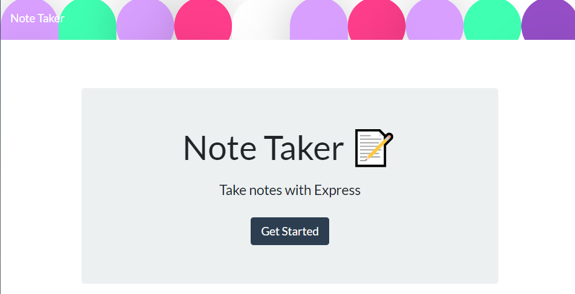
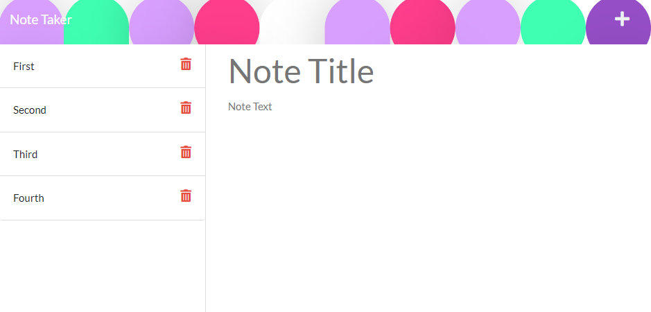

# Note Taker 

## Description
This project was designed to assist the busy student or professional on the go. Quickly jot down ideas or notes in the notepad.

## Table of Contents

- [Installation](#installation)
- [Usage](#usage)
- [License](#license)
- [Credits](#credits)
- [Contributions](#contributions)
- [Testing](#testing)
- [Questions](#questions)

## Installation
Clone from my repo or download the zip file. Install Node, navigate to the root directory,type npm install.

## Usage

Navigate to the root directory and type npm start. Head to either localhost:3001/ or check out the heroku link 

## License

This project is using MIT. For more information on this or other licenses please reference: [https://choosealicense.com](https;//choosealicense.com).

MIT

## Credits

N/A

## Contributions

This project is using [Contributor Covenant] (https://www.contributor-covenant.org/) Please read over their guidelines before contributing.

## Testing Instructions

N/A

## Questions
You can contact me via my [Github Profile](https://github.com/dy9040)
or by email test@test.com if you have any questions.